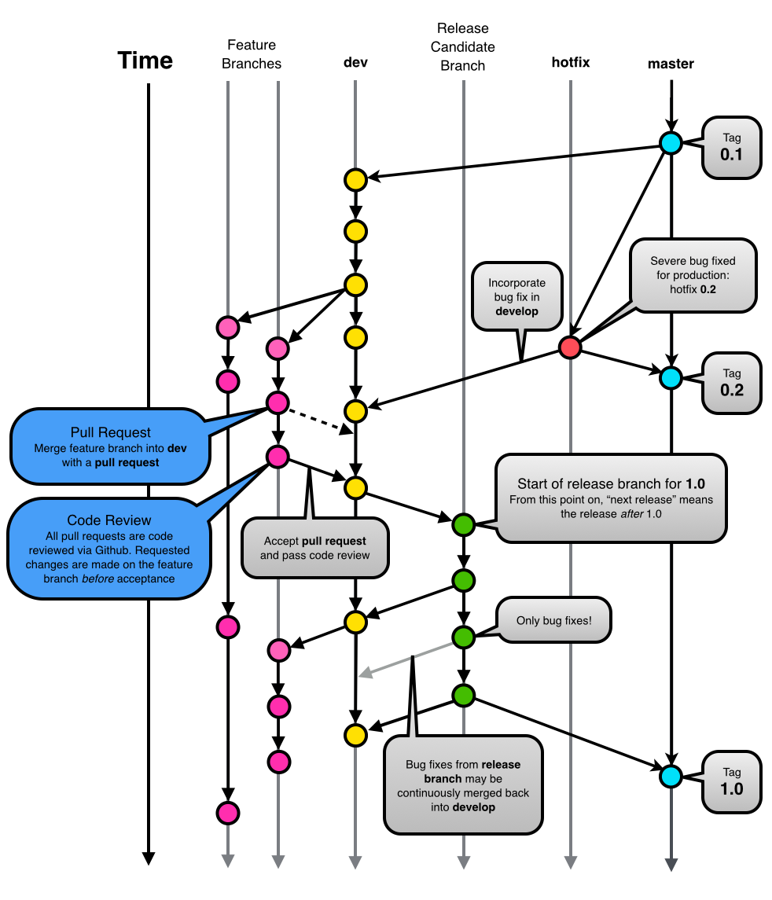

code-style-guides
=================

Code style guides for all Modern Web projects.

- - -
# Github

This section details how to use Github and related time tracking tools.

## Issues

__The Golden Github Rules:__
 - Every commit must reference a Github issue.
 - Close commits using commit messages ([see how]( https://help.github.com/articles/closing-issues-via-commit-messages/))

## Git Workflow & Pull Requests

Use a __feature branch__ to semantically differentiate commits for each feature.

Use __hotfix__ for hot fixing bugs found in master.

Use __dev__ as the primary development branch (however, most commits should be
  on a feature branch)

Merge feature branches with a __pull request__. All pull requests must be code
reviewed before acceptance into the __dev__ branch.

Git flow visualized (modified from
  [Vincent Driessen](http://nvie.com/posts/a-successful-git-branching-model/))




# Time Tracking

[Everhour](https://everhour.com) is our current solution for time tracking with
Github integration. Each Everhour time tracking item must reference at least one
Github issue number.

# Meteor

## Directory Structure

TODO

## Packages

TODO

# Coffeescript

## Overview

Generally follow https://github.com/polarmobile/coffeescript-style-guide

TODO: Document inconsistencies here

## Configuration

All commits should be linted by [coffeelint](http://www.coffeelint.org/).

Use `coffeescript/coffeelint.json` and `coffeescript/pre-commit`.

_Recommended set up:_

Copy `coffeelint.json` to `~/dev/`

Copy `pre-commit` script to `~/dev/githooks/coffeescript/`.

For the Atom editor, use https://atom.io/packages/linter-coffeelint.

Install coffeelint node package
```sh
npm install -g coffeelint
```
Create symbolic link for `pre-commit` git hook (run from root project directory).
```sh
ln -sf ~/dev/githooks/coffeescript/pre-commit .git/hooks/pre-commit
```
